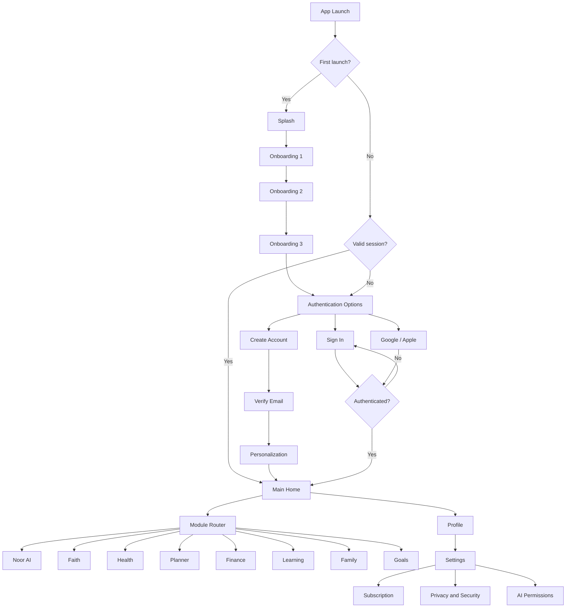
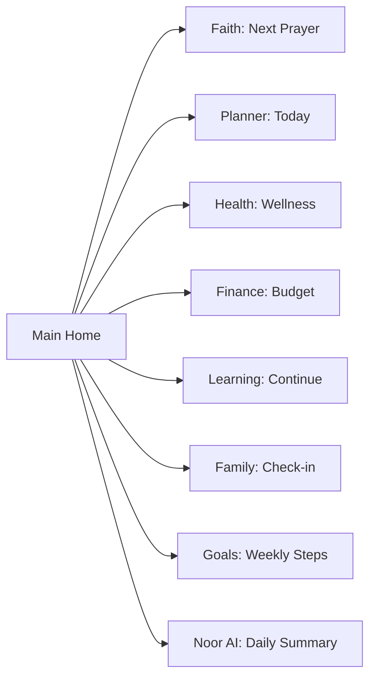
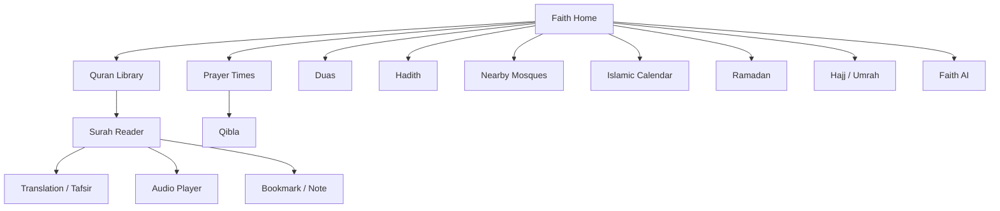
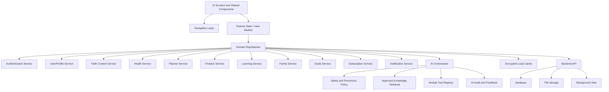
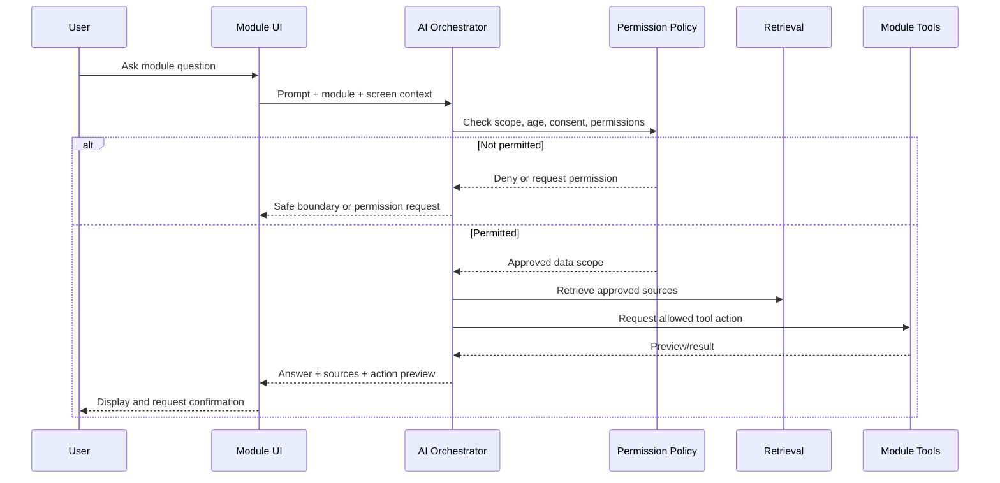

# NoorLife Production Workflow and Screen Architecture

Version: 1.0  
Companion specification: `NOORLIFE_UI_DESIGN_SPEC.md`  
Purpose: Source of truth for starting the NoorLife project in VS Code with Claude

## 1. What the production mock package contains

The visual package is divided into four boards:

1. Entry, onboarding, and authentication
2. Main Home and eight core modules
3. Account, settings, privacy, family roles, and subscriptions
4. System, recovery, validation, and AI safety states

These boards establish the reusable visual system and primary routes. The detailed feature screens listed below must be implemented with the same components and module themes.

## 2. Application-level workflow



## 3. Navigation contract

### 3.1 Global destinations

| Route | Destination |
|---|---|
| `/home` | Main Home |
| `/modules` | All Modules |
| `/ai` | Noor AI |
| `/insights` | Cross-module insights |
| `/profile` | Profile |
| `/settings` | Settings |
| `/notifications` | Notification center |

### 3.2 Module entry rule

All module cards on Main Home and All Modules open the module's default home route.

```text
/faith
/health
/planner
/finance
/learning
/family
/goals
```

Each module owns its internal navigator. Pressing Back from the module root returns to the screen that opened it, normally Main Home or All Modules.

### 3.3 Module AI rule

The center navigation button opens AI inside the current module:

```text
/faith/ai
/health/ai
/planner/ai
/finance/ai
/learning/ai
/family/ai
/goals/ai
```

Module AI receives:

- Current module ID
- Current screen
- Current user permissions
- Explicitly allowed module data
- Approved module tools
- Module safety policy

Module AI must not silently cross into another module. Cross-module requests are handed to Noor AI after user confirmation.

## 4. Entry and account routes

```text
/splash
/onboarding/one
/onboarding/two
/onboarding/three
/auth
/auth/sign-in
/auth/sign-up
/auth/verify-email
/auth/forgot-password
/auth/reset-password
/auth/biometric
/personalization
```

Production rules:

- Persist onboarding completion locally and in the user profile.
- Support interrupted sign-up and email verification.
- Rate-limit verification and password-reset requests.
- Store authentication tokens in secure device storage.
- Provide session expiry and revoked-session handling.
- Require recent authentication for password, email, payment, or account-deletion changes.

## 5. Main Home screen workflow

Main Home aggregates data; it does not own module records.

Data sources:

- Next prayer from Faith
- Today's tasks/events from Planner
- Wellness summary from Health
- Family check-in from Family
- Learning streak from Learning
- Budget summary from Finance
- Goal progress from Goals
- Suggestions from Noor AI

When a user taps an aggregate card, navigate to the source module detail screen. Never duplicate editing logic on Main Home.



## 6. Noor AI screens

Required routes:

```text
/ai
/ai/chat/:conversationId
/ai/history
/ai/saved
/ai/permissions
/ai/sources
/ai/feedback
```

Required screens:

1. Noor AI Home
2. New conversation
3. Conversation detail
4. Conversation history
5. Saved answer
6. Source and citation viewer
7. Module access request
8. AI unavailable
9. AI safety boundary
10. Report or rate response

Noor AI is limited to NoorLife help and approved module actions. It is not marketed as a general-purpose chatbot.

## 7. Faith module workflow

### Routes

```text
/faith
/faith/quran
/faith/quran/:surahId
/faith/quran/:surahId/:ayahId
/faith/tafsir/:ayahId
/faith/audio
/faith/bookmarks
/faith/hadith
/faith/hadith/:collectionId
/faith/hadith/:collectionId/:hadithId
/faith/duas
/faith/duas/:categoryId
/faith/prayer-times
/faith/qibla
/faith/tasbih
/faith/mosques
/faith/mosques/:mosqueId
/faith/calendar
/faith/ramadan
/faith/hajj
/faith/umrah
/faith/settings
/faith/ai
```

### Primary flows



Production requirements:

- Licensed Quran text and translations
- Source attribution
- Arabic rendering and verse markers
- Audio download and offline playback
- Bookmark synchronization
- Prayer calculation preferences
- Location permission fallback
- Qibla sensor calibration
- Hadith grading and collection metadata
- Faith AI citations and clear uncertainty

## 8. Health module workflow

### Routes

```text
/health
/health/log
/health/activity
/health/sleep
/health/water
/health/mood
/health/medications
/health/medications/new
/health/appointments
/health/trends
/health/records
/health/export
/health/ai
```

### Required screens

1. Health Home
2. Quick Log sheet
3. Steps/activity detail
4. Sleep entry and history
5. Water entry and history
6. Mood check-in
7. Medication list
8. Add/edit medication
9. Medication reminder
10. Appointments
11. Weekly/monthly trends
12. Health-record permissions
13. Export health data
14. Health AI

Health AI may summarize and encourage general wellness. It must not diagnose or prescribe.

## 9. Planner module workflow

### Routes

```text
/planner
/planner/calendar
/planner/day/:date
/planner/event/new
/planner/event/:eventId
/planner/tasks
/planner/tasks/new
/planner/tasks/:taskId
/planner/routines
/planner/routines/:routineId
/planner/reminders
/planner/conflicts
/planner/ai
```

### Required screens

1. Planner Home
2. Day view
3. Week view
4. Month view
5. Create/edit event
6. Task list
7. Create/edit task
8. Routine list
9. Routine builder
10. Reminder editor
11. Schedule conflict
12. AI optimization preview
13. Confirm schedule changes
14. Planner AI

AI suggestions must be shown as a preview. Calendar changes require confirmation.

## 10. Finance module workflow

### Routes

```text
/finance
/finance/transactions
/finance/transactions/new
/finance/transactions/:transactionId
/finance/budgets
/finance/budgets/:budgetId
/finance/bills
/finance/bills/:billId
/finance/savings
/finance/family-budget
/finance/zakat
/finance/reports
/finance/export
/finance/ai
```

### Required screens

1. Finance Home
2. Transactions
3. Add/edit transaction
4. Categories
5. Budget list
6. Budget detail
7. Create/edit budget
8. Bills and reminders
9. Savings goals
10. Family budget
11. Zakat calculator
12. Reports
13. Export data
14. Money AI

Money AI can summarize and categorize. It cannot provide investment, tax, or legal advice.

## 11. Learning module workflow

### Routes

```text
/learning
/learning/catalog
/learning/course/:courseId
/learning/course/:courseId/lesson/:lessonId
/learning/player/:lessonId
/learning/quiz/:quizId
/learning/results/:attemptId
/learning/study-plan
/learning/reading-list
/learning/downloads
/learning/progress
/learning/ai
```

### Required screens

1. Learning Home
2. Course catalog
3. Course detail
4. Lesson list
5. Lesson player
6. Reading view
7. Quiz
8. Quiz result
9. Study-plan builder
10. Reading list
11. Downloads
12. Progress
13. Certificate or completion
14. Learn AI

## 12. Family module workflow

### Routes

```text
/family
/family/members
/family/invite
/family/member/:memberId
/family/roles
/family/calendar
/family/check-in
/family/parenting
/family/activities
/family/memories
/family/memories/new
/family/memory/:memoryId
/family/shared-goals
/family/safety
/family/permissions
/family/ai
```

### Required screens

1. Family Home
2. Member list
3. Invite member
4. Member profile
5. Roles and permissions
6. Shared calendar
7. Private check-in
8. Shared check-in summary
9. Parenting guidance
10. Activity suggestions
11. Memory timeline
12. Create memory/story
13. Shared goals
14. Safety controls
15. Data-sharing permissions
16. Family AI

Private child and adult entries must follow explicit sharing rules. Do not infer consent.

## 13. Goals module workflow

### Routes

```text
/goals
/goals/new
/goals/:goalId
/goals/:goalId/edit
/goals/:goalId/steps
/habits
/habits/new
/habits/:habitId
/goals/shared
/goals/progress
/goals/wins
/goals/ai
```

### Required screens

1. Goals Home
2. Goal list
3. Create/edit goal
4. Goal detail
5. Weekly steps
6. Habit list
7. Create/edit habit
8. Habit check-in
9. Shared goal
10. Progress history
11. Milestone celebration
12. Wins archive
13. Goal AI

## 14. Settings, privacy, family, and billing routes

```text
/profile
/profile/edit
/settings
/settings/notifications
/settings/privacy
/settings/security
/settings/sessions
/settings/ai-permissions
/settings/appearance
/settings/accessibility
/settings/language
/settings/data
/settings/consent-history
/settings/help
/settings/about
/family/roles
/subscription
/subscription/single
/subscription/family
/subscription/yearly
/subscription/manage
/subscription/billing-history
```

## 15. Shared production states

Every asynchronous feature must support:

- Initial loading
- Background refresh
- Empty
- First-use empty
- Partial data
- Success
- Recoverable error
- Server unavailable
- Maintenance
- Offline
- Slow network
- Permission required
- Permission denied
- Session expired
- Validation error
- Unsaved changes
- Destructive confirmation
- AI unavailable
- AI safety boundary

Do not build separate custom state components in each module. Use the shared `StateView` with module theme injection.

## 16. Service integration architecture



## 17. AI orchestration workflow



## 18. Suggested project structure

Use feature-first organization:

```text
src/
  app/
    navigation/
    providers/
    startup/
  design-system/
    tokens/
    typography/
    components/
    illustrations/
  features/
    auth/
    onboarding/
    home/
    ai/
    faith/
    health/
    planner/
    finance/
    learning/
    family/
    goals/
    profile/
    settings/
    subscription/
  services/
    api/
    auth/
    ai/
    notifications/
    storage/
    analytics/
  shared/
    models/
    validation/
    permissions/
    states/
    utils/
```

## 19. Recommended build phases

### Phase 1: Foundation

- Select mobile framework
- Create project
- Add navigation
- Add design tokens and Poppins
- Build shared components
- Implement light theme, RTL foundations, and accessibility

### Phase 2: App shell

- Splash and onboarding
- Authentication
- Personalization
- Main Home
- Module router
- Profile and settings shell

### Phase 3: Module vertical slices

Build one complete feature from each module before expanding:

- Faith: Quran reader
- Health: daily log
- Planner: event/task creation
- Finance: transaction and budget
- Learning: course and lesson
- Family: member invitation and check-in
- Goals: create goal and weekly steps

### Phase 4: AI

- AI permissions
- Noor AI
- Module-specific AI
- Citations
- Action preview and confirmation
- Safety boundaries and feedback

### Phase 5: Commercial and production

- Subscriptions and entitlement checks
- Notifications
- Offline cache and synchronization
- Analytics and crash reporting
- Data export and account deletion
- Security, accessibility, localization, and performance testing

## 20. Release readiness checklist

Do not call the app production-ready until:

- Authentication and recovery are tested
- Authorization is enforced server-side
- Child and family permissions are tested
- AI permissions and safety rules are enforced
- Faith sources and licensing are approved
- Health and finance disclaimers are reviewed
- Subscription restore/cancel paths work
- Data export and account deletion work
- Offline and sync conflicts are handled
- Arabic and RTL layouts are tested
- Screen reader and text scaling pass
- Analytics excludes sensitive content
- Logs do not expose private information
- Automated unit, integration, and end-to-end tests pass
- Privacy Policy, Terms, consent records, and store disclosures are ready

## 21. Claude project-start instruction

Use this at the beginning of the new VS Code project:

> Build NoorLife using `NOORLIFE_UI_DESIGN_SPEC.md` and `NOORLIFE_PRODUCTION_WORKFLOW.md` as immutable product and design sources of truth. First create the shared design tokens, reusable components, navigation contracts, module theme configuration, typed routes, loading/error state framework, permissions framework, and service interfaces. Do not start with isolated hard-coded screens. Main Home aggregates module data but does not own it. Each module owns its navigator and dedicated AI route. Every module home uses the shared HeroCard. Faith is green-led, Health is light-blue-led, and all screens use a neutral canvas. All module bottom navigations reserve the center item for the approved robot-head module AI. Require user confirmation before AI performs mutations. Preserve accessibility, RTL, privacy, and family/child safety from the first implementation.

